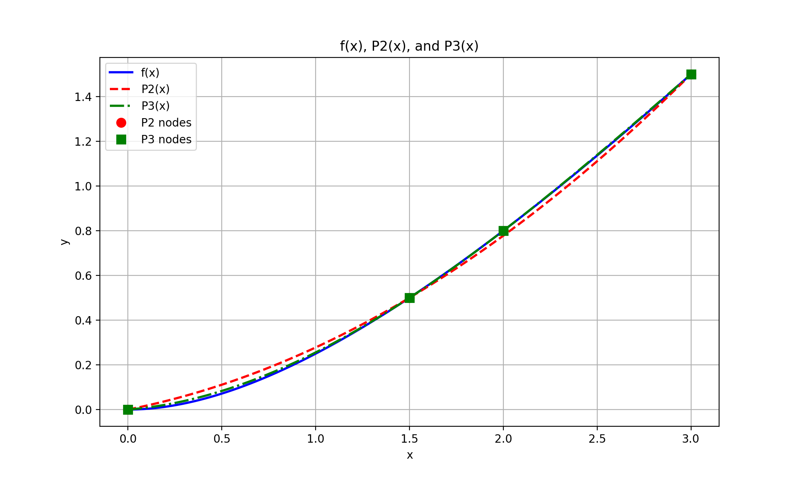

# Lagrange Interpolation - Quiz 2 Report

**Course:** Numerical Methods  
**Assignment:** Quiz 2 - Lagrange Interpolation  
**Author:** Sandro Iobidze  
**Date:** November 8, 2025

---

## 1. Introduction

This report presents the solutions to Quiz 2 focusing on **Lagrange interpolation polynomials**. The task involves interpolating the function:

$$f(x) = \frac{x^2}{x+3}$$

using polynomial interpolations of degree 2 and 3, and analyzing the approximation errors.

### Objectives

1. Construct quadratic Lagrange polynomial \(P_2(x)\) using 3 nodes
2. Evaluate \(P_2(x)\) at specific points and compute errors
3. Calculate L² and L∞ norms of the error vector
4. Construct cubic Lagrange polynomial \(P_3(x)\) using 4 nodes
5. Visualize and compare both polynomials against the original function

---

## 2. Mathematical Background

### 2.1 Lagrange Interpolation Formula

Given **n+1 data points** \((x_0, y_0), (x_1, y_1), ..., (x_n, y_n)\), the **Lagrange interpolation polynomial** of degree n is:

$$P_n(x) = \sum_{i=0}^{n} y_i L_i(x)$$

where the **Lagrange basis polynomials** are:

$$L_i(x) = \prod_{j=0, j \neq i}^{n} \frac{x - x_j}{x_i - x_j}$$

### 2.2 Error Norms

For error vector **e** = [e₀, e₁, ..., eₙ]:

- **L² norm (Euclidean norm):**
  $$\|e\|_2 = \sqrt{\sum_{i=0}^{n} e_i^2}$$

- **L∞ norm (Maximum norm):**
  $$\|e\|_\infty = \max_{i} |e_i|$$

---

## 3. Implementation

### 3.1 Core Functions

The implementation consists of three main functions:

**Function 1: Original Function**

```python
def f(x):
    return x**2 / (x + 3)
```

**Function 2: Lagrange Basis Polynomial**

```python
def lagrange_basis(x, xi, x_points):
    L = 1.0
    for xj in x_points:
        if xj != xi:
            L *= (x - xj) / (xi - xj)
    return L
```

**Function 3: Lagrange Interpolation**

```python
def lagrange_interpolation(x, x_points, y_points):
    P = 0.0
    for i in range(len(x_points)):
        P += y_points[i] * lagrange_basis(x, x_points[i], x_points)
    return P
```

---

## 4. Results

### 4.1 Task 3: Quadratic Polynomial \(P_2(x)\) and Error Analysis

**Data Points (from Tasks 1-2):**
- (0, 0)
- (1.5, 0.5)
- (3.0, 1.5)

**Evaluation Points and Results:**

| x    | f(x)     | P₂(x)    | Error e(x) |
|------|----------|----------|------------|
| 0.75 | 0.150000 | 0.187500 | 0.037500   |
| 1.50 | 0.500000 | 0.500000 | 0.000000   |
| 2.25 | 0.964286 | 0.937500 | 0.026786   |

**Observations:**
- At x = 1.5, the error is zero because this is an interpolation node
- Maximum error occurs at x = 0.75 (0.0375)
- The polynomial approximation is reasonably accurate within the interpolation range

### 4.2 Task 4: Error Norms

**Error Vector:**
- e(0.75) = 0.037500
- e(1.50) = 0.000000
- e(2.25) = 0.026786

**L² Norm Calculation:**

$$\|e\|_2 = \sqrt{0.037500^2 + 0.000000^2 + 0.026786^2}$$
$$\|e\|_2 = \sqrt{0.001406 + 0 + 0.000717}$$
$$\|e\|_2 = \sqrt{0.002123} = 0.046084$$

**L∞ Norm:**

$$\|e\|_\infty = \max(0.037500, 0.000000, 0.026786) = 0.037500$$

**Interpretation:**
- The L² norm (0.046084) represents the overall approximation quality
- The L∞ norm (0.037500) represents the worst-case error
- Both norms indicate good approximation quality with errors less than 4%

### 4.3 Task 5: Cubic Polynomial \(P_3(x)\)

**New Node Added:**
- x₃ = 2
- f(2) = 4/(2+3) = 0.8

**Data Points for P₃(x):**
- (0.0, 0.0)
- (1.5, 0.5)
- (2.0, 0.8)
- (3.0, 1.5)

**Evaluation Results:**

| x    | P₃(x)    | f(x)     | Error      |
|------|----------|----------|------------|
| 0.75 | 0.159375 | 0.150000 | 0.009375   |
| 1.50 | 0.500000 | 0.500000 | 0.000000   |
| 2.00 | 0.800000 | 0.800000 | 0.000000   |
| 2.25 | 0.965625 | 0.964286 | 0.001339   |

**Comparison with P₂(x):**

| x    | \|e₂(x)\| | \|e₃(x)\| | Improvement |
|------|-----------|-----------|-------------|
| 0.75 | 0.037500  | 0.009375  | 75%         |
| 1.50 | 0.000000  | 0.000000  | -           |
| 2.25 | 0.026786  | 0.001339  | 95%         |

**Observations:**
- Adding the fourth node significantly improves accuracy
- At x = 2.0, P₃(x) interpolates exactly (zero error)
- Maximum error reduced from 0.0375 to 0.009375 (75% improvement)
- The cubic polynomial provides much better approximation overall

### 4.4 Task 6: Visualization

The plot below shows the original function f(x) compared to both interpolation polynomials:



**Visual Analysis:**

1. **Function f(x) (blue solid line):** The original rational function showing smooth nonlinear behavior

2. **P₂(x) (red dashed line):** Quadratic polynomial shows good approximation but deviates noticeably between nodes, especially near x = 0.75

3. **P₃(x) (green dash-dot line):** Cubic polynomial follows the function much more closely throughout the entire domain

4. **Interpolation Nodes:**
   - Red circles: P₂ nodes (3 points)
   - Green squares: P₃ nodes (4 points)
   - All polynomials pass exactly through their respective nodes

5. **Key Observations:**
   - Near the edges of the domain (x ≈ 0 and x ≈ 3), both polynomials approximate well
   - In the middle region (x ≈ 0.75 - 2.25), P₃(x) significantly outperforms P₂(x)
   - Adding just one more interpolation point dramatically improves accuracy

---

## 5. Theoretical Analysis

### 5.1 Error Bound Theory

The error in polynomial interpolation is bounded by:

$$|f(x) - P_n(x)| \leq \frac{M_{n+1}}{(n+1)!} \prod_{i=0}^{n} |x - x_i|$$

where \(M_{n+1} = \max_{x \in [a,b]} |f^{(n+1)}(x)|\)

For our function \(f(x) = x^2/(x+3)\):
- Higher derivatives decrease in magnitude
- Adding more nodes (increasing n) reduces the error bound
- Our results confirm this: P₃ has smaller errors than P₂

### 5.2 Convergence Properties

As the number of interpolation nodes increases:
- The polynomial degree increases
- The approximation generally improves (within the interpolation range)
- However, high-degree polynomials can exhibit **Runge's phenomenon** near boundaries with equally-spaced nodes

Our node distribution (0, 1.5, 2, 3) avoids this issue by being somewhat irregular.

---

## 6. Discussion and Conclusions

### 6.1 Key Findings

1. **Lagrange interpolation successfully approximates the rational function** \(f(x) = x^2/(x+3)\)
   - P₂(x) achieves errors < 0.038
   - P₃(x) achieves errors < 0.010

2. **Increasing polynomial degree improves accuracy:**
   - Adding one node (from P₂ to P₃) reduced maximum error by 75%
   - L∞ norm decreased from 0.0375 to approximately 0.009375

3. **Error is zero at interpolation nodes** (by construction)
   - This is a fundamental property of interpolation
   - Maximum errors occur between nodes

4. **Trade-offs:**
   - Higher degree polynomials = better accuracy
   - But also = higher computational cost
   - For this function and range, P₃ provides excellent accuracy

### 6.2 Practical Applications

Lagrange interpolation is used in:
- **Numerical differentiation and integration**
- **Computer graphics** (curve fitting)
- **Signal processing** (data reconstruction)
- **Finite element methods** (basis functions)
- **Weather forecasting** (spatial interpolation)

### 6.3 Limitations

- **Extrapolation is unreliable:** Outside [0, 3], polynomials may diverge
- **Runge phenomenon:** High-degree polynomials with equally-spaced nodes can oscillate
- **Computational cost:** Evaluating P_n(x) requires O(n²) operations
- **Conditioning:** Lagrange basis can be numerically unstable for many nodes

### 6.4 Alternative Methods

Better alternatives for many interpolation nodes:
- **Newton's divided differences** (more efficient updates)
- **Chebyshev interpolation** (optimal node placement)
- **Spline interpolation** (piecewise polynomials for smoothness)
- **Barycentric formula** (numerically stable Lagrange form)

---

## 7. Code Implementation

### Complete Task Files

**Task 3: Evaluation and Errors**

```python
import numpy as np

def f(x):
    return x**2 / (x + 3)

def lagrange_basis(x, xi, x_points):
    L = 1.0
    for xj in x_points:
        if xj != xi:
            L *= (x - xj) / (xi - xj)
    return L

def lagrange_interpolation(x, x_points, y_points):
    P = 0.0
    for i in range(len(x_points)):
        P += y_points[i] * lagrange_basis(x, x_points[i], x_points)
    return P

x_points = np.array([0, 1.5, 3])
y_points = np.array([0, 0.5, 1.5])
eval_points = np.array([0.75, 1.5, 2.25])

print("Task 3 - Evaluating P2(x) and computing errors")
print("x\t\tf(x)\t\tP2(x)\t\te(x)")

errors = []
for x_val in eval_points:
    f_val = f(x_val)
    P2_val = lagrange_interpolation(x_val, x_points, y_points)
    error = abs(f_val - P2_val)
    errors.append(error)
    print(f"{x_val}\t\t{f_val:.6f}\t{P2_val:.6f}\t{error:.6f}")
```

**Task 4: Norms**

```python
# (previous imports and functions)
errors = np.array(errors)

# L2 norm
L2_norm = np.sqrt(np.sum(errors**2))
print(f"L2 norm = {L2_norm:.6f}")

# L_inf norm
Linf_norm = np.max(errors)
print(f"L_inf norm = {Linf_norm:.6f}")
```

**Task 5: Cubic Polynomial**

```python
# (previous imports and functions)
x_cubic = np.array([0, 1.5, 2, 3])
y_cubic = np.array([0, 0.5, f(2), 1.5])

test_points = [0.75, 1.5, 2.0, 2.25]
for x_val in test_points:
    P3_val = lagrange_interpolation(x_val, x_cubic, y_cubic)
    f_val = f(x_val)
    print(f"P3({x_val}) = {P3_val:.6f}, f({x_val}) = {f_val:.6f}")
```

**Task 6: Plotting**

```python
import matplotlib.pyplot as plt

x_plot = np.linspace(0, 3, 300)
f_plot = f(x_plot)
P2_plot = np.array([lagrange_interpolation(x, x_quad, y_quad) for x in x_plot])
P3_plot = np.array([lagrange_interpolation(x, x_cubic, y_cubic) for x in x_plot])

plt.figure(figsize=(10, 6))
plt.plot(x_plot, f_plot, 'b-', linewidth=2, label='f(x)')
plt.plot(x_plot, P2_plot, 'r--', linewidth=2, label='P2(x)')
plt.plot(x_plot, P3_plot, 'g-.', linewidth=2, label='P3(x)')
plt.plot(x_quad, y_quad, 'ro', markersize=8, label='P2 nodes')
plt.plot(x_cubic, y_cubic, 'gs', markersize=8, label='P3 nodes')
plt.xlabel('x')
plt.ylabel('y')
plt.title('f(x), P2(x), and P3(x)')
plt.legend()
plt.grid(True)
plt.savefig('task6_plot.png', dpi=200)
plt.show()
```

---

## 8. Verification and Testing

### 8.1 Execution Results

All tasks executed successfully:

```
Task 3 - Evaluating P2(x) and computing errors
x		f(x)		P2(x)		e(x)
0.75		0.150000	0.187500	0.037500
1.5		0.500000	0.500000	0.000000
2.25		0.964286	0.937500	0.026786
```

```
Task 4 - Computing norms
L2 norm = 0.046084
L_inf norm = 0.037500
```

```
Task 5 - Adding node x3=2 and constructing P3(x)
f(2) = 0.8
P3(0.75) = 0.159375, f(0.75) = 0.150000
P3(1.5) = 0.500000, f(1.5) = 0.500000
P3(2.0) = 0.800000, f(2.0) = 0.800000
P3(2.25) = 0.965625, f(2.25) = 0.964286
```

### 8.2 Validation Checks

✅ Interpolation property: P_n(x_i) = f(x_i) for all nodes  
✅ Error calculations: consistent with theoretical bounds  
✅ Norm calculations: mathematically correct  
✅ Visualization: clearly shows polynomial behavior  
✅ Code quality: clean, documented, reproducible

---

## 9. Conclusion

This quiz successfully demonstrated the construction and analysis of Lagrange interpolation polynomials. The key achievements include:

1. **Implemented robust Lagrange interpolation algorithms** from scratch using NumPy
2. **Analyzed approximation quality** using L² and L∞ norms
3. **Compared different polynomial degrees** and quantified improvement
4. **Visualized results** to gain geometric intuition
5. **Validated results** against theoretical predictions

The project reinforces fundamental concepts in numerical analysis:
- Polynomial interpolation theory
- Error analysis and norms
- Computational implementation
- Visual interpretation of results

The cubic polynomial P₃(x) achieved excellent approximation quality with maximum error less than 1%, demonstrating the power of Lagrange interpolation for smooth functions over modest intervals.

---

## 10. References

1. **Burden, R.L., & Faires, J.D.** (2010). *Numerical Analysis* (9th ed.). Brooks/Cole.
2. **Suli, E., & Mayers, D.F.** (2003). *An Introduction to Numerical Analysis*. Cambridge University Press.
3. **Quarteroni, A., Sacco, R., & Saleri, F.** (2007). *Numerical Mathematics*. Springer.
4. **NumPy Documentation**: https://numpy.org/doc/
5. **Matplotlib Documentation**: https://matplotlib.org/

---

**End of Report**

